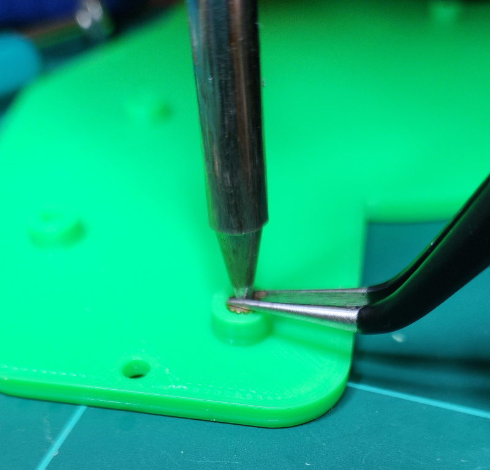

# Harite Keyboard (WIP)

Harite is 5-way switch keyboard with dual trackpads. The word Harite is the Sumo Slap attack in Japanese, I thought it was appropriate since it looks like a grabbing hand with the 5 joysticks for each finger and the trackpad as the palm.

## BOM

- Harite PCB - order from your preferred PCB manufacturer using the gerber files in the [gerber_to_order](./gerber_to_order) folder
- 2 x RP2040-Zero MCU with headers 2.5mm height
- 2 x Cirque 40mm Trackpads TM040040-2024-302 flat overlay
- 2 x HRO TYPE-C-31-M-12 USB C female ports
- 10 x SKRHADE010 5-way switches
- 50 x 1N4148 SOD-123 Diodes
- 1 x USB-C to USB-C cable to connect halves
- 1 x USB-C to USB-A/C cable to connect to pc
- 10 x M2 6mm flat head screws for base
- 10 x M2 4mm flat head screws for pcb
- 20 x Knurled Insert Nuts M2 x 3mm Length x 3.5mm outer diameter
- 6 x insulated wires 6cm approx. to connect cirque trackpad the the PCB. I used some ethernet cable which contiains 8 wires inside and stripped the ends with an Irwin vise-grip
- 3D printed Case and joystick caps - the STLs are in the [printables](./printables) folder. If you want to modify anything, this is the [Onshape Project](https://cad.onshape.com/documents/b93bd8dc5e080887b7a35bc8/w/2fa13694cc5562fc6be45ae5/e/f3942d0fbdb4c55aacbbd3d2)
- Blu tak or similar to stick down Cirque trackpad
- Soldering tools

## Steps

### Firmware

- Install [QMK CLI](https://github.com/qmk/qmk_cli)
- Git clone my [QMK Firmware](https://github.com/dlip/qmk_firmware/tree/dlip/keyboards/harite) and flash to both RP2040-Zero to ensure they aren't dead

### Soldering

- Since its quite challenging, solder on the usb ports on both sides. Watch this [YouTube video on drag soldering](https://www.youtube.com/watch?v=uguPxmkmaSg&t=163s&ab_channel=OffTheClack) for tips. You can then connect them with your usb cable and test the connection with a multimeter: set it to continuity mode and ensure you only hear a beep when connecting the following pairs by testing one of the pairs against every other pin.
- Solder RP2040-Zero with headers - if the legs on the on the headers are longer than 3mm you will need to cut them shorter. Flux the pads on the bottom of the pcb and the top of the RP2040-Zero, then insert into the top of the pcb and slide RP2040-Zero onto it to ensure the legs are straight. You can use sticky tape on the top to hold it in place while soldering the bottom side, then remove the tape and complete the top side.
- Test RP2040-Zero and connection between halves:

  - IMPORTANT: You must never connect or disconnect the halves while they are connected to the computer since it may cause a power surge and fry some components.
  - Connect halves via USB-C cable
  - Connect either half's RP2040-Zero to the computer
  - Run `qmk console` and check the output. If you don't see "Target connected" after a few retries there is a connection issue

  ```
    Ψ Console Connected: Dane Lipscombe harite (FEED:0000:1)
    Dane Lipscombe:harite:1: Failed to execute slave_matrix
    Dane Lipscombe:harite:1: Target disconnected, throttling connection attempts
    Dane Lipscombe:harite:1: Failed to execute slave_matrix
    Dane Lipscombe:harite:1: Target disconnected, throttling connection attempts
    Dane Lipscombe:harite:1: Failed to execute slave_matrix
    Dane Lipscombe:harite:1: Target disconnected, throttling connection attempts
    Dane Lipscombe:harite:1: Target connected
  ```

  - Connect GPIO pins 13 and 14 with something metal and observe a letter 'L' is typed to the computer screen

- Solder 5 way switches - the side with the 'v' shape cutout goes at the top, relative to the PCB's switch label (north east for the left side and north west for the right side)
- Solder diodes - the side with the line on the diode goes at the tip of the arrow on the PCB's label
- Test the 5 way switches are working by connecting this half to the PC via the RP2040-Zero with the USB cable and pressing each direction then its center switch
- Solder Cirque trackpad to the PCB, matching the labels on them. I found the best position was to have the Cirque and PCB both face down, and angle the wires somewhat vertically so they don't touch or bend too much when inserting not the top cover. You can give this a test on the computer afterwards too.

### Case

- Melt knurled insert nuts into holes in the base and top. Heat soldering iron to about 170c temperature and melt while holding the nut down with tweezers to ensure its level.



- Screw the PCB to the 3D printed base using the M2 4mm screws
- Put the 3D printed top over the top while feeding the Cirque trackpad through the slit and into position, following the 2 notches to ensure it has the correct rotation. Add some Blu tak to keep it from coming out.
- Repeat the process for the other half
- Connect one half to the computer and test
- Flash my QMK engram layout to the RP2040-Zero or make your own
- Play [Eye of the tiger](https://www.youtube.com/watch?v=CiIkBT-HFOA&ab_channel=n1ckr1vers) and start your training. Good luck!
