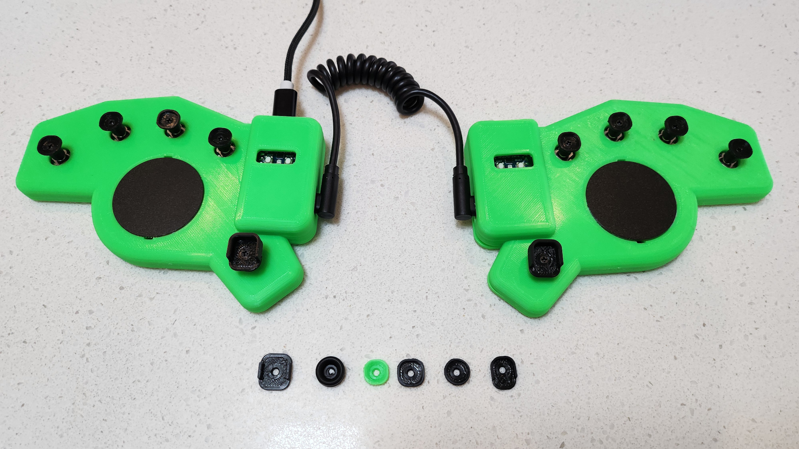

# Harite 5-way Switch Keyboard

- 5-way switches - SKRHADE010 rated at 1,000,000 cycles for each direction
- RP2040-Zero controller
- Split using USB-C to connect the halves
- Dual Cirque 40mm trackpads (optional - you can put a Ploopy or other small trackball in place instead)
- QMK Firmware
- Custom PCB and case
- Hot-swapable joystick caps
- The name comes from the Sumo Slap attack in Japanese
- [YouTube Demonstration](https://youtu.be/vVsztPqckJc)
- If you would like to make your own, checkout the detailed [build guide](build.md)
