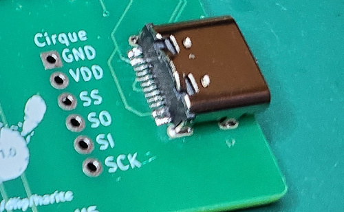
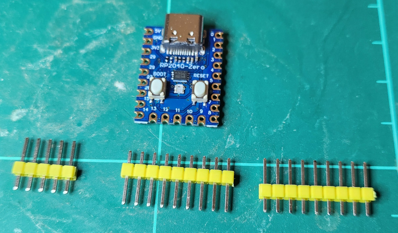
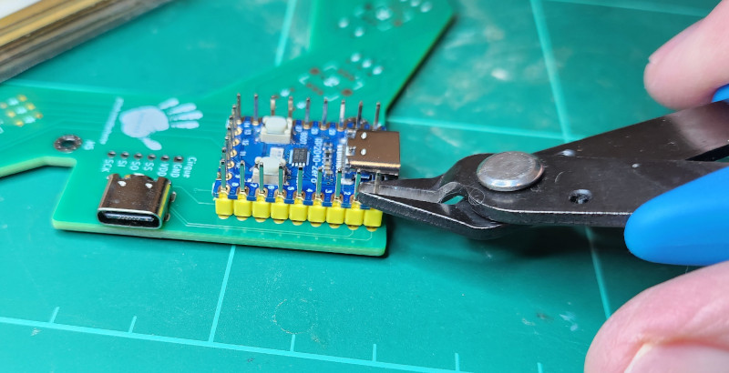
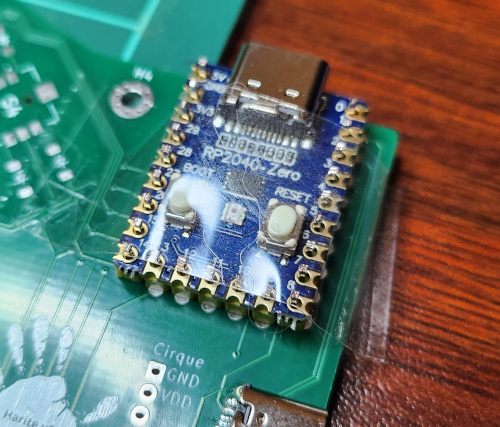
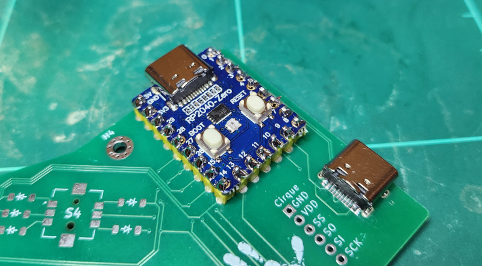
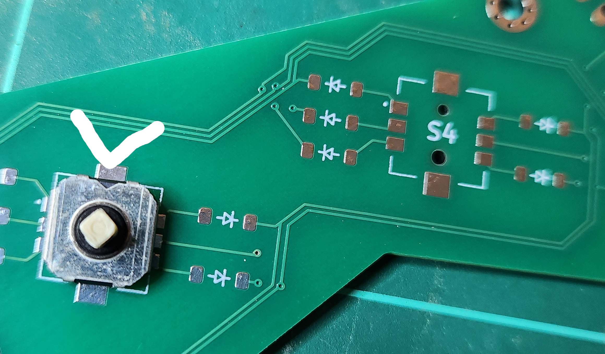
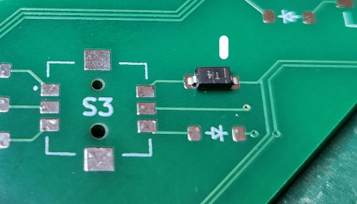
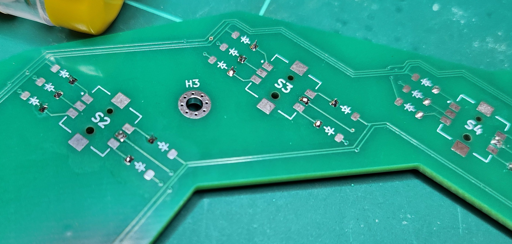

# Harite Build Guide

## BOM

- Harite PCB - order from your preferred PCB manufacturer using the gerber files in the [gerber_to_order](./gerber_to_order) folder
- 2 x RP2040-Zero controller with headers 2.5mm height
- 2 x Cirque 40mm Trackpads TM040040-2024-302 flat overlay
- 2 x HRO TYPE-C-31-M-12 USB C female ports
- 10 x SKRHADE010 5-way switches
- 50 x 1N4148 SOD-123 Diodes
- 1 x USB-C to USB-C cable to connect halves
- 1 x USB-C to USB-A/C cable to connect to pc
- 10 x M2 5mm flat head screws for base
- 10 x M2 4mm flat head screws for pcb
- 20 x Knurled Insert Nuts M2 x 3mm Length x 3.5mm outer diameter
- 6 x insulated wires 6cm approx. to connect cirque trackpad the the PCB. I used some ethernet cable which contiains 8 wires inside and stripped the ends with an Irwin vise-grip
- 3D printed Case and joystick caps - the STLs are in the [printables](./printables) folder. If you want to modify anything, this is the [Onshape Project](https://cad.onshape.com/documents/b93bd8dc5e080887b7a35bc8/w/2fa13694cc5562fc6be45ae5/e/f3942d0fbdb4c55aacbbd3d2)
- Blu tak or similar to stick down Cirque trackpad
- Soldering tools

## Steps

### Firmware

It's a good idea to flash both RP2040-Zero to ensure they aren't dead

- Install [QMK CLI](https://github.com/qmk/qmk_cli)
- Git clone my [QMK Firmware](https://github.com/dlip/qmk_firmware/tree/dlip/keyboards/harite)

```
git clone https://github.com/dlip/qmk_firmware.git
cd qmk_firmware
```

- Hold the boot button while connecting the RP2040-Zero and a new drive should appear
- Flash the left

```
qmk flash -kb harite -km default -bl uf2-split-left
```

- Flash the right

```
qmk flash -kb harite -km default -bl uf2-split-right
```

### Soldering USB Port



- Since its quite challenging, solder on the usb ports on both sides. Watch this [YouTube video on drag soldering](https://www.youtube.com/watch?v=uguPxmkmaSg&t=163s&ab_channel=OffTheClack) for tips.
- Test the connections with a multimeter: set it to continuity mode and ensure you only hear a beep when connecting the following pairs by testing one of the pairs against every other pin.


### Soldering RP2040-Zero



- If the legs on the on the headers are longer than 3mm you will need to cut them shorter.



- Insert into the top of the pcb and slide RP2040-Zero onto it to ensure the legs are straight. You can use sticky tape on the top to hold it in place.



- Flip the board to solder the bottom side, then remove the tape and solder the top side.



### Test Connection Between Halves

- IMPORTANT: You must never connect or disconnect the halves while they are connected to the computer since it may cause a power surge and fry some components.
- Connect halves via USB-C cable
- Connect either half's RP2040-Zero to the computer
- Run `qmk console` and check the output. If you see "Target connected" after a few retries you are good to continue

```
Ψ Console Connected: Dane Lipscombe harite (FEED:0000:1)
Dane Lipscombe:harite:1: Failed to execute slave_matrix
Dane Lipscombe:harite:1: Target disconnected, throttling connection attempts
Dane Lipscombe:harite:1: Failed to execute slave_matrix
Dane Lipscombe:harite:1: Target disconnected, throttling connection attempts
Dane Lipscombe:harite:1: Failed to execute slave_matrix
Dane Lipscombe:harite:1: Target disconnected, throttling connection attempts
Dane Lipscombe:harite:1: Target connected
```

- Connect GPIO pins 13 and 14 with something metal on each side, and confirm if a letter 'L' is typed to the computer screen

### Soldering 5 Way Switches and Diodes

- Be careful with the switch orientation: the side with the 'v' shape cutout goes at the top, relative to the PCB's switch label (north east for the left side and north west for the right side)



- Be careful with the diode orientation: the side with the line on the diode goes at the tip of the arrow on the PCB's label



- Prepare each set of pads by soldering one of its pads



- Solder the first pad of each component. Ensure they are all aligned to the other pads then solder the rest of them.


- Test the 5 way switches are working by connecting this half to the PC via the RP2040-Zero with the USB cable and pressing each direction then its center switch. You should see these characters typed for each direction: 'u', 'd', 'l', 'r', 'c'

### Cirque Trackpad

- Solder Cirque trackpad to the PCB, matching the labels on them. I found the best position was to have the Cirque and PCB both face down, and angle the wires somewhat vertically so they don't touch or bend too much when inserting not the top cover. You can give this a test on the computer afterwards too.

### Case

- Melt knurled insert nuts into holes in the base and top. Heat soldering iron to about 170c temperature and melt while holding the nut down with tweezers to ensure its level.


- Screw the PCB to the 3D printed base using the M2 4mm screws
- Put the 3D printed top over the top while feeding the Cirque trackpad through the slit and into position, following the 2 notches to ensure it has the correct rotation. Add some Blu tak to keep it from coming out.
- Repeat the process for the other half
- Connect one half to the computer and test
- Flash my QMK engram layout to the RP2040-Zero or make your own
- Play [Eye of the tiger](https://www.youtube.com/watch?v=CiIkBT-HFOA&ab_channel=n1ckr1vers) and start your training. Good luck!
